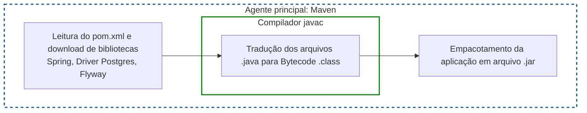
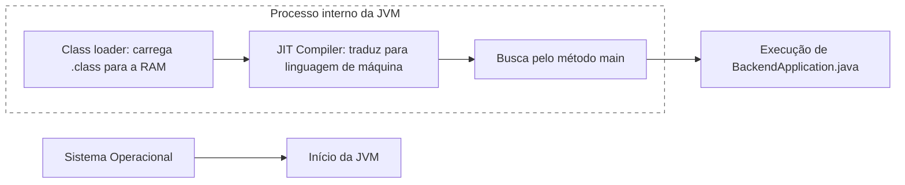
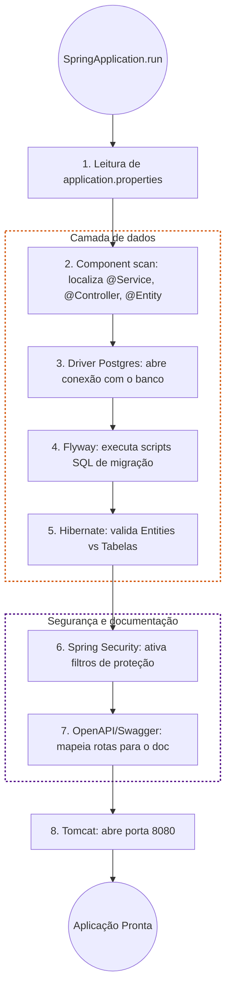

# 📚 Referência técnica: arquitetura e ferramentas
Este documento descreve a fundação tecnológica do projeto de Flashcards e serve
de documentação auxiliar para todos os desenvolvedores do grupo.

---

## 1. Arquitetura do sistema
O projeto utiliza uma arquitetura de **Sistema Distribuído**, projetada para separar 
responsabilidades e otimizar recursos. Ela é dividida em três frentes principais:

- **Frontend (React):** interface do usuário onde o estudante pratica os cards e 
o administrador gerencia os decks.
- **Backend principal (Spring Boot):** o "cérebro" monolítico do negócio. Gerencia 
de forma centralizada os usuários, segurança (JWT), progresso de aprendizado e persiste 
os dados no banco PostgreSQL.
- **Python Service (FastAPI):** um serviço especializado (satélite) focado em processamento 
pesado e IA. Ele não guarda estado (*stateless*) e atua apenas sob demanda do Spring Boot 
para gerar frases (OpenAI), buscar imagens e sintetizar voz, isolando a complexidade 
dessas bibliotecas do backend principal.

Essa separação garante que, caso as APIs externas (OpenAI/Pexels) fiquem indisponíveis, 
o sistema principal continua no ar, permitindo que os estudantes continuem revisando os 
flashcards já existentes.

---

## 2. Stack - Spring Boot
Abaixo estão as ferramentas selecionadas via Spring Initializr e a explicação 
de qual "dor" elas resolvem no projeto:

### Persistência e Banco de Dados
- **PostgreSQL Driver:** "tradutor" que permite ao Java conversar com o banco de dados PostgreSQL.
- **Spring Data JPA:** facilita a vida com o banco. Ao invés de SQL puro `(SELECT * FROM...)`, 
usamos interfaces Java para salvar e buscar objetos. Ele usa o *Hibernate* por baixo dos panos 
para mapear as classes para tabelas.
- **Flyway Migration:** É o "Git do Banco de Dados". Ele garante que todos os desenvolvedores 
tenham a mesma estrutura de tabelas. Sempre que é feita uma alteração no *schema*, é criado um 
arquivo de script no Flyway, e ele atualiza o banco de todos automaticamente ao rodar o projeto.

> **NOTA:** o Flyway é **agnóstico de ambiente**. Isso significa que ele não se importa se o 
> banco de dados está rodando no seu computador (`localhost`) ou em um servidor da Amazon do 
> outro lado do mundo. Isso funciona da seguinte forma:
> 1. Quando o deploy da API for feito, o Spring Boot vai ler o arquivo `.env` (ou as 
> configurações de segredo da plataforma de hospedagem) que conterá a URL e credenciais do 
> banco de dados na nuvem (como o Neon.tech ou AWS RDS).
> 2. Assim que o servidor ligar apontando para a nuvem, o Flyway vai olhar para o banco de 
> produção e comparar com os arquivos `.sql` existentes no projeto. Se houver um arquivo novo 
> (ex: `V3__adicionar_coluna_idade.sql`), ele aplicará a mudança automaticamente no banco da 
> nuvem antes de liberar a API para uso.

### Comunicação e API
- **Spring Web:** dependência base para criar APIs REST. Permite que o Java receba requisições 
do Frontend e envie dados de volta em formato JSON.
- **Springdoc OpenAPI (Swagger):** gera automaticamente uma página web para teste dos controllers. 
Auxilia os desenvolvedores do frontend oferecendo uma interface para testes com as rotas existentes.

### Segurança e validação
- **Spring Security:** controla quem pode acessar o quê. Será o responsável por gerenciar o login 
e proteger as rotas de administrador para que apenas usuários autenticados criem novos decks.
- **Validation:** serve para garantir que os dados que chegam na API estão corretos. 
Exemplo: impede que um usuário seja criado sem e-mail ou que uma palavra em mandarim venha vazia, 
retornando um erro amigável antes mesmo de tentar salvar no banco.

---

## 3. Stack - Python Services
- **FastAPI:** framework web que servirá para expor os scripts de IA como endpoints 
que o Java pode chamar.
- **OpenAI SDK:** para integração com o GPT-4o-mini.
- **Edge-TTS:** para gerar áudios com vozes neurais realistas sem custo.

---

## 4. Detalhamento da arquitetura de pacotes
A estrutura de pacotes foi desenhada seguindo o padrão de Arquitetura em Camadas,
visando o desacoplamento e a facilidade de manutenção.

### 📂 `com.projflashcards.backend.model` & `repository`
* `model`: representação fiel do banco de dados (*entities*). Utiliza `UUID` para IDs dos
  usuários (incluindo casos onde tabelas utilizam os mesmos como chaves estrangeiras) e `Long`
  para IDs específicos de outras entidades, visando segurança e escalabilidade em
  sistemas distribuídos.
* `repository`: camada de persistência que utiliza o Spring Data JPA para abstrair as
  *queries* SQL, permitindo que o foco permaneça nos dados e não na sintaxe do banco.

### 📂 `com.projflashcards.backend.service`
Onde reside a verdade sobre as regras de negócio de cada entidade em particular.
* `AuthorizationService`: serviço técnico que implementa interfaces do Spring Security
  (`UserDetailsService`) para converter usuários do banco em objetos que o Spring entende.
* `UserService`:
    * Contém regras de permissão fina no `validatePermissions`, garantindo que um usuário comum
      não altere dados de outro;
    * Define as regras do corpo de requisição das rotas presentes no `controller`, garantindo a
      integridade dos dados inseridos/alterados no banco e gerenciando o ciclo de vida da entidade.

### 📂 `com.projflashcards.backend.security`
Este é o pacote "transversal" do sistema. Ele não lida com regras de negócio de flashcards,
mas com a integridade do acesso.
* `TokenService`: especialista em JWT e criptografia. Sua função é construir e validar o
  Java Web Token, possuindo dois métodos:
    * `generateToken`: constrói o token, embutindo no mesmo de forma criptografada o email do
      usuário ao qual ele pertence, além de definir seu tempo de expiração;
    * `validateToken`: verifica se o token presente no *header* não está expirado e se possui
      as informações que devem obrigatoriamente estar presentes e criptografadas no mesmo.
* `SecurityFilter`: age como interceptor e garante que ninguém chegue aos Controllers sem que
  o `SecurityContextHolder` esteja devidamente preenchido.
* `SecurityConfigurations`: onde definimos a quais rotas são públicas e quais são privadas.
* `UserDetailsImpl`: ponte entre a entidade `User` e o Spring Security. Ele "empacota" os dados 
do usuário (como e-mail, senha e roles) no formato exato que a arquitetura do Spring exige para 
gerenciar a sessão ativa e validar permissões a cada requisição.

### 📂 `com.projflashcards.backend.controller`
Camada dedicada ao tratamento do protocolo HTTP.
* Controllers de **DOMÍNIO** (ex: `UserController`): atuam como delegados. Recebem a requisição,
  validam o `DTO` e passam a informação limpa para o `Service`. Não possuem lógica de decisão.
* Controllers de **INFRAESTRUTURA** (ex: ``AuthenticationController``): diferem dos demais, pois
  são o ponto de entrada da segurança. Eles orquestram o `AuthenticationManager`
  para validar credenciais.

### 📂 `com.projflashcards.backend.dto`
Crucial para o desacoplamento. Garante que mudanças na estrutura da tabela (Entity) não quebrem o
contrato com o Frontend (React), além de evitar a exposição de dados sensíveis como o `password_hash`.

---

## 5. Diagramação auxiliar

### Fase 1: o trabalho do Maven (*build* e compilação)
Antes de executar, o código legível para humanos precisa ser traduzido e empacotado. **O Maven
realiza as seguintes tarefas:**

1. Lê o `pom.xml`, verifica a lista de dependências (Flyway, JPA, Postgres, etc.), vai 
até a internet (Maven Central) e baixa todos esses pacotes de terceiros na máquina.
2. Chama o compilador do Java (`javac`). O compilador pega todos os arquivos .java e os 
traduz para *bytecode*, gerando arquivos `.class`. O *bytecode* é uma linguagem intermediária 
que qualquer computador entende, desde que tenha o Java instalado.
3. Junta todos os arquivos .class, mais os arquivos do Spring Boot e de todas as dependências, e 
empacota tudo em um único arquivo `.jar` (Java ARchive).

### Fase 2: despertar da JVM (execução)
Quando a aplicação principal é executada, o sistema operacional chama a JVM (Java Virtual Machine).

1. **Class loader:** a JVM pega o arquivo `.jar` e começa a carregar as classes para a memória RAM.
2. **Execução Just-In-Time (JIT):** a JVM lê o bytecode (arquivos `.class`) e os traduz em tempo 
real para a linguagem de máquina específica do processador.
3. **Ponto de entrada:** a JVM procura o método `public static void main(String[] args)` 
dentro da classe `BackendApplication` e dá o "start".

### Fase 3: atuação do Spring Boot e ferramentas
Assim que o método main chama o `SpringApplication.run()`, as ferramentas trabalham na
seguinte sequência de orquestração:

1. **Varredura (component scan):** o Spring Boot vasculha todas as pastas do projeto procurando 
classes que tenham anotações dele (como `@RestController`, `@Entity`, `@Service`). Ele "anota 
mentalmente" onde cada coisa está.

2. **Conexão com o banco:** o driver do PostgreSQL é ativado. O Spring tenta fazer "login" no 
banco de dados usando as credenciais que estão no arquivo `application.properties`.

3. **Flyway:** antes de deixar o sistema mexer nos dados, o Spring acorda o Flyway. O Flyway 
olha para o banco de dados e para a pasta de migrações (`src/main/resources/db/migration`). 
Se houver algum script SQL novo, o Flyway roda no banco imediatamente.

4. **Mapeamento de dados (Spring Data JPA / Hibernate):** com o banco atualizado pelo Flyway, 
o JPA lê as classes do pacote `model` e as "conectam" com a tabela correspondente do banco, 
preparando o terreno para a execução de buscas e inserções, sem escrever SQL.

5. **Spring Security:** levanta um conjunto de filtros ao redor da aplicação. 
Ele bloqueia tudo por padrão, até que você configure quais rotas são públicas (como o login) 
e quais exigem token JWT.

6. **Springdoc OpenAPI:**  lê todos os controllers e gera um arquivo JSON dinâmico.
Ele cria a interface visual do Swagger baseada nos caminhos que encontrou.

7. **Spring Web / Tomcat:** por fim, o Spring Boot liga o servidor web embutido (Apache Tomcat), 
geralmente na porta 8080.

Ao final, o terminal deve exibir a mensagem `Started BackendApplication in X.XXX seconds`. 
A aplicação estará escutando a porta 8080 e esperando o envio de requisições HTTP.

---
