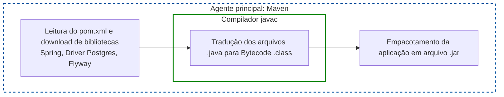
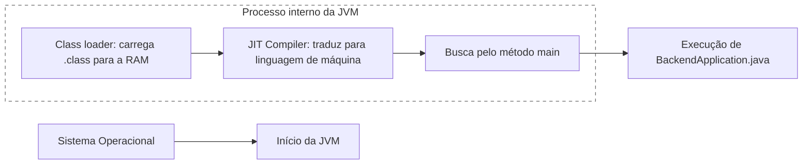
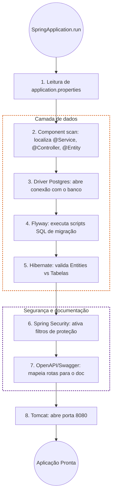
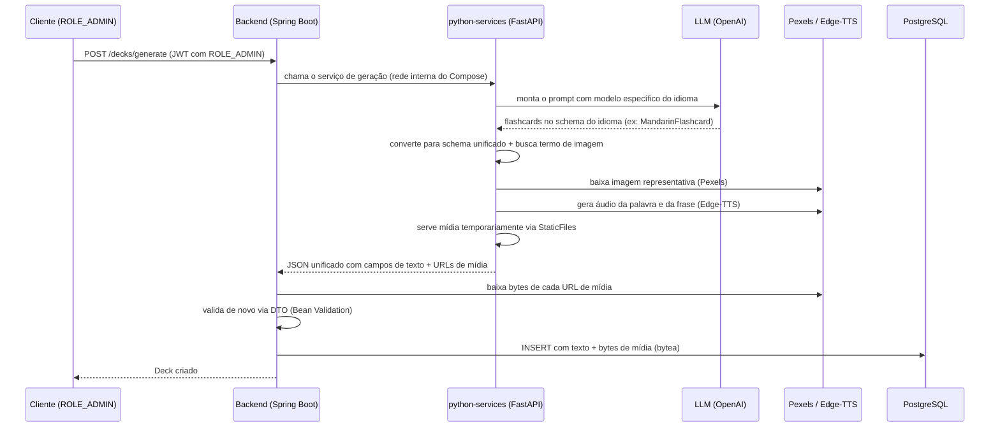

# 📚 Referência técnica: arquitetura e ferramentas
Este documento descreve a fundação tecnológica do projeto de Flashcards e serve
de documentação auxiliar para todos os desenvolvedores do grupo.

---

## 1. Arquitetura do sistema
```
ProjetoFlashcards/
├── AGENTS.md                 # configuração de skills do agente
├── CONTEXT.md                # glossário do domínio
├── docs/
│   ├── adr/                  # decisões arquiteturais
│   │   └── 0001-media-storage.md
│   ├── agents/               # configuração do issue tracker, triage, domain docs
│   │   ├── domain.md
│   │   ├── issue-tracker.md
│   │   └── triage-labels.md
│   ├── ARCHITECTURE.md       # este arquivo
│   ├── API_CHEATSHEET.md     # exemplos de requisição (cURL + Postman) para as rotas já existentes
│   └── TODO.md               # checklist do que falta implementar, por módulo
├── .scratch/                 # issues e specs locais (markdown)
├── docker-compose.yml        # orquestra backend + python-services, único cenário de execução
├── backend/
│   ├── src/main/java/com/projflashcards/backend/    # backend construído com Spring Boot
│   ├── src/main/resources/
│   │   ├── db/migration/             # migrações Flyway
│   │   └── application.properties    # conexão com BD, JWT, JPA e Swagger
│   ├── Dockerfile            # build multi-stage do backend (Maven -> JRE)
│   └── pom.xml               # dependências do backend, gerenciadas pelo Maven
├── frontend/
└── python-services/          # serviço de IA para geração de flashcards
    ├── main.py               # endpoint FastAPI (/generate, /)
    ├── modulos/              # módulos de domínio
    │   ├── llm_agent.py      # chamada ao OpenAI com modelos Pydantic por idioma
    │   ├── buscador_imagens.py   # busca de imagens via Pexels
    │   ├── gerador_audio.py      # síntese de voz via Edge-TTS
    │   ├── gerador_apkg.py       # exportação para Anki (.apkg)
    │   └── language_config.py    # configuração por idioma (voz, deck name)
    ├── requirements.txt
    └── Dockerfile            # build multi-stage do serviço Python (builder -> runtime)
```

O projeto utiliza uma arquitetura de **Sistema Distribuído**, projetada para separar 
responsabilidades e otimizar recursos. Ela é dividida em três frentes principais:

- **Frontend (React):** interface do usuário onde o estudante cria a conta, consulta o catálogo
de decks e pratica os cartões demonstrativos.
- **Backend principal (Spring Boot):** o "cérebro" monolítico do negócio. Gerencia 
de forma centralizada os usuários, segurança (JWT), progresso de aprendizado e persiste 
os dados no banco PostgreSQL.
- **Python Service (FastAPI):** um serviço especializado (satélite) focado em processamento 
pesado e IA. Ele não guarda estado (*stateless*) e atua apenas sob demanda do Spring Boot. 
Gera flashcards via OpenAI, busca imagens representativas via Pexels e sintetiza áudio de 
pronúncia via Edge-TTS. Retorna ao Java um JSON unificado com campos de texto + URLs 
temporárias de mídia; o Java faz o download dos bytes e persiste tudo no PostgreSQL 
(ver ADR-0001). Isola a complexidade das APIs externas do backend principal.

Essa separação também evita que uma indisponibilidade da OpenAI/Pexels derrube autenticação,
catálogo ou favoritos. Hoje essa independência é ainda mais direta: o backend depende do container
Python estar iniciado, mas nenhuma rota Java implementada chama o serviço de IA.

### Execução: um único cenário, sempre contra o Neon
Todo o sistema sobe por um único `docker-compose.yml`, apontando sempre pro banco na nuvem (Neon) —
tanto em desenvolvimento quanto em produção. **Não existe Postgres local em lugar nenhum** do projeto:
o `application.properties` também não tem fallback de banco; sem as variáveis do Neon (`DB_URL`,
`DB_USERNAME`, `DB_PASSWORD`), a aplicação simplesmente não sobe.

> Já existiu um `docker-compose.override.yml` que subia um Postgres local descartável, mesclado
> automaticamente por cima do compose principal. Foi removido de propósito: teve gente do grupo com
> drift de versão no Podman — a sintaxe recente da Compose Spec usada no override (`env_file` com
> `required: false`) não rodava nesse ambiente — e um banco centralizado no Neon acabou sendo mais
> simples de manter do que dois arquivos Compose sincronizados. Se alguém sujar os dados de teste, a
> saída combinada é recriar a instância no Neon e redistribuir as credenciais no grupo.

---

## 2. Stack - Spring Boot
Abaixo estão as ferramentas selecionadas via Spring Initializr e a explicação 
de qual "dor" elas resolvem no projeto:

### Persistência e Banco de Dados
- **PostgreSQL Driver:** "tradutor" que permite ao Java conversar com o banco de dados PostgreSQL.
- **Spring Data JPA:** facilita a vida com o banco. Ao invés de SQL puro `(SELECT * FROM...)`, 
usamos interfaces Java para salvar e buscar objetos. Ele usa o *Hibernate* por baixo dos panos 
para mapear as classes para tabelas.
- **Flyway Migration:** É o "Git do Banco de Dados". Ele garante que todos os desenvolvedores 
tenham a mesma estrutura de tabelas. Sempre que é feita uma alteração no *schema*, é criado um 
arquivo de script no Flyway, e ele atualiza o banco de todos automaticamente ao rodar o projeto.

> **NOTA:** o Flyway é **agnóstico de ambiente**. Isso significa que ele não se importa se o 
> banco de dados está rodando no seu computador (`localhost`) ou em um servidor da Amazon do 
> outro lado do mundo. Isso funciona da seguinte forma:
> 1. Quando o deploy da API for feito, o Spring Boot vai ler o arquivo `.env` (ou as 
> configurações de segredo da plataforma de hospedagem) que conterá a URL e credenciais do 
> banco de dados na nuvem (como o Neon.tech ou AWS RDS).
> 2. Assim que o servidor ligar apontando para a nuvem, o Flyway vai olhar para o banco de 
> produção e comparar com os arquivos `.sql` existentes no projeto. Se houver um arquivo novo 
> (ex: `V3__adicionar_coluna_idade.sql`), ele aplicará a mudança automaticamente no banco da 
> nuvem antes de liberar a API para uso.

### Comunicação e API
- **Spring Web:** dependência base para criar APIs REST. Permite que o Java receba requisições 
do Frontend e envie dados de volta em formato JSON.
- **Springdoc OpenAPI (Swagger):** gera automaticamente uma página web para teste dos controllers. 
Auxilia os desenvolvedores do frontend oferecendo uma interface para testes com as rotas existentes.

### Segurança e validação
- **Spring Security:** controla quem pode acessar o quê. Será o responsável por gerenciar o login 
e proteger as rotas de administrador para que apenas usuários autenticados criem novos decks.
- **Validation:** serve para garantir que os dados que chegam na API estão corretos. 
Exemplo: impede que um usuário seja criado sem e-mail ou que uma palavra em mandarim venha vazia, 
retornando um erro amigável antes mesmo de tentar salvar no banco.

---

## 3. Stack - Python Services
- **FastAPI:** framework web que expõe os scripts de IA como endpoints que o Java pode chamar.
  - `GET /health` — liveness check, sem auth, retorna `{"status": "ok"}`
  - `GET /` — rota genérica, retorna `{"status": "AI Service running"}`
  - `POST /generate` — geração de flashcards, protegida por `INTERNAL_SECRET`
- **OpenAI SDK:** para integração com o GPT-4o-mini (fallback) e o modelo `gpt-5` via 
  `client.beta.chat.completions.parse` com resposta estruturada por idioma.
- **Edge-TTS:** para gerar áudios com vozes neurais realistas sem custo.
- **Pydantic:** usado em duas camadas — models específicos por idioma (`llm_agent.py`) e 
  schema unificado de resposta (`main.py`).
- **Requests:** cliente HTTP para baixar imagens da API do Pexels.

---

## 4. Stack - Frontend React
O frontend é uma SPA sem biblioteca de roteamento. `App.tsx` observa
`window.location.pathname`, atualiza o histórico com `pushState` e distribui as páginas
manualmente.

### O que já conversa com o backend
* `POST /users`: cadastro;
* `POST /login`: login e obtenção do JWT;
* `GET /decks`: catálogo exibido no dashboard.

O cliente usa `/api` por padrão. Durante o desenvolvimento, o proxy do Vite remove esse prefixo
e encaminha a requisição para `http://localhost:8080`. Em outro ambiente,
`VITE_API_URL` substitui a URL base.

### O que ainda é local/demonstrativo
* `frontend/src/data/decks.ts` contém os decks e cartões usados pela tela `/study/{id}`;
* favoritos da interface ficam em `karta.favorites.{email}`;
* preferências ficam em `karta.preferences.{email}`;
* progresso de cada deck fica em `karta.study.{email}.{deckId}`;
* a sessão JWT fica em `karta.session`.

Isso cria uma diferença importante: o dashboard lista qualquer deck existente no PostgreSQL,
mas a tela de estudo só reconhece os IDs `1`, `2` e `3` definidos nos dados demonstrativos. Os
endpoints de favoritos do backend existem, porém o frontend ainda não os chama.

O JWT é lido no navegador para verificar a claim `exp`. Ao expirar — ou quando uma chamada
autenticada devolve `401` — a sessão local é removida e a tela de login informa que é necessário
entrar novamente.

---

## 5. Detalhamento da arquitetura de pacotes
A estrutura de pacotes foi desenhada seguindo o padrão de Arquitetura em Camadas,
visando o desacoplamento e a facilidade de manutenção.

### 📂 `com.projflashcards.backend.model` & `repository`
* `model`: representação fiel do banco de dados (*entities*). Utiliza `UUID` para IDs dos
  usuários (incluindo casos onde tabelas utilizam os mesmos como chaves estrangeiras) e `Long`
  para IDs específicos de outras entidades, visando segurança e escalabilidade em
  sistemas distribuídos.
* `repository`: camada de persistência que utiliza o Spring Data JPA para abstrair as
  *queries* SQL, permitindo que o foco permaneça nos dados e não na sintaxe do banco.

### 📂 `com.projflashcards.backend.service`
Onde reside a verdade sobre as regras de negócio de cada entidade em particular.
* `AuthorizationService`: serviço técnico que implementa interfaces do Spring Security
  (`UserDetailsService`) para converter usuários do banco em objetos que o Spring entende.
* `UserService`:
    * Contém regras de permissão fina no `validatePermissions`, garantindo que um usuário comum
      não altere dados de outro;
    * Define as regras do corpo de requisição das rotas presentes no `controller`, garantindo a
      integridade dos dados inseridos/alterados no banco e gerenciando o ciclo de vida da entidade.
* `DeckService`:
    * Usa o usuário autenticado como autor ao criar um deck;
    * Lista/busca decks e os converte para `DeckSummaryDTO`.
* `UserFavoriteService`:
    * Valida se o usuário autenticado é dono do recurso ou administrador;
    * Gerencia a relação muitos-para-muitos persistida em `user_favorite_decks`.

### 📂 `com.projflashcards.backend.security`
Este é o pacote "transversal" do sistema. Ele não lida com regras de negócio de flashcards,
mas com a integridade do acesso.
* `TokenService`: especialista em JWT e criptografia. Sua função é construir e validar o
  Java Web Token, possuindo dois métodos:
    * `generateToken`: constrói o token, embutindo no mesmo de forma criptografada o email do
      usuário ao qual ele pertence, além de definir seu tempo de expiração;
    * `validateToken`: verifica se o token presente no *header* não está expirado e se possui
      as informações que devem obrigatoriamente estar presentes e criptografadas no mesmo.
* `SecurityFilter`: age como interceptor e garante que ninguém chegue aos Controllers sem que
  o `SecurityContextHolder` esteja devidamente preenchido.
* `SecurityConfigurations`: onde definimos a quais rotas são públicas e quais são privadas.
* `UserDetailsImpl`: ponte entre a entidade `User` e o Spring Security. Ele "empacota" os dados 
do usuário (como e-mail, senha e roles) no formato exato que a arquitetura do Spring exige para 
gerenciar a sessão ativa e validar permissões a cada requisição.

### 📂 `com.projflashcards.backend.controller`
Camada dedicada ao tratamento do protocolo HTTP.
* Controllers de **DOMÍNIO** (ex: `UserController`): atuam como delegados. Recebem a requisição,
  validam o `DTO` e passam a informação limpa para o `Service`. Não possuem lógica de decisão.
* Controllers de **INFRAESTRUTURA** (ex: ``AuthenticationController``): diferem dos demais, pois
  são o ponto de entrada da segurança. Eles orquestram o `AuthenticationManager`
  para validar credenciais.

### 📂 `com.projflashcards.backend.dto`
Crucial para o desacoplamento. Garante que mudanças na estrutura da tabela (Entity) não quebrem o
contrato com o Frontend (React), além de evitar a exposição de dados sensíveis como o `password_hash`.

---

## 6. Diagramação auxiliar

### Fase 1: o trabalho do Maven (*build* e compilação)
Antes de executar, o código legível para humanos precisa ser traduzido e empacotado. **O Maven
realiza as seguintes tarefas:**

1. Lê o `pom.xml`, verifica a lista de dependências (Flyway, JPA, Postgres, etc.), vai 
até a internet (Maven Central) e baixa todos esses pacotes de terceiros na máquina.
2. Chama o compilador do Java (`javac`). O compilador pega todos os arquivos .java e os 
traduz para *bytecode*, gerando arquivos `.class`. O *bytecode* é uma linguagem intermediária 
que qualquer computador entende, desde que tenha o Java instalado.
3. Junta todos os arquivos .class, mais os arquivos do Spring Boot e de todas as dependências, e 
empacota tudo em um único arquivo `.jar` (Java ARchive).


```mermaid
graph TD

    subgraph Maven [Agente principal: Maven]
        A[Leitura do pom.xml e download de bibliotecas<br/>Spring, Driver Postgres, Flyway] --> B
        subgraph Javac [Compilador javac]
            B[Tradução dos arquivos .java para Bytecode .class]
        end
        B --> C[Empacotamento da aplicação em arquivo .jar]
    end

    style Maven fill:transparent,stroke:#00509E,stroke-width:2px,stroke-dasharray: 5 5
    style Javac fill:transparent,stroke:#008000,stroke-width:2px
```

### Fase 2: despertar da JVM (execução)
Quando a aplicação principal é executada, o sistema operacional chama a JVM (Java Virtual Machine).

1. **Class loader:** a JVM pega o arquivo `.jar` e começa a carregar as classes para a memória RAM.
2. **Execução Just-In-Time (JIT):** a JVM lê o bytecode (arquivos `.class`) e os traduz em tempo 
real para a linguagem de máquina específica do processador.
3. **Ponto de entrada:** a JVM procura o método `public static void main(String[] args)` 
dentro da classe `BackendApplication` e dá o "start".


```mermaid
graph LR
    OS[Sistema Operacional] --> JVM[Início da JVM]
    subgraph JVM_Process [Processo interno da JVM]
        CL[Class loader: carrega .class para a RAM] --> JIT[JIT Compiler: traduz para linguagem de máquina]
        JIT --> MAIN[Busca pelo método main]
    end
    MAIN --> START[Execução de BackendApplication.java]

    style JVM_Process fill:transparent,stroke:#666,stroke-dasharray: 5 5
```

### Fase 3: atuação do Spring Boot e ferramentas
Assim que o método main chama o `SpringApplication.run()`, as ferramentas trabalham na
seguinte sequência de orquestração:

1. **Varredura (component scan):** o Spring Boot vasculha todas as pastas do projeto procurando 
classes que tenham anotações dele (como `@RestController`, `@Entity`, `@Service`). Ele "anota 
mentalmente" onde cada coisa está.

2. **Conexão com o banco:** o driver do PostgreSQL é ativado. O Spring tenta fazer "login" no 
banco de dados usando as credenciais que estão no arquivo `application.properties`.

3. **Flyway:** antes de deixar o sistema mexer nos dados, o Spring acorda o Flyway. O Flyway 
olha para o banco de dados e para a pasta de migrações (`src/main/resources/db/migration`). 
Se houver algum script SQL novo, o Flyway roda no banco imediatamente.

4. **Mapeamento de dados (Spring Data JPA / Hibernate):** com o banco atualizado pelo Flyway, 
o JPA lê as classes do pacote `model` e as "conectam" com a tabela correspondente do banco, 
preparando o terreno para a execução de buscas e inserções, sem escrever SQL.

5. **Spring Security:** levanta um conjunto de filtros ao redor da aplicação. 
Ele bloqueia tudo por padrão, até que você configure quais rotas são públicas (como o login) 
e quais exigem token JWT.

6. **Springdoc OpenAPI:**  lê todos os controllers e gera um arquivo JSON dinâmico.
Ele cria a interface visual do Swagger baseada nos caminhos que encontrou.

7. **Spring Web / Tomcat:** por fim, o Spring Boot liga o servidor web embutido (Apache Tomcat), 
geralmente na porta 8080.

Ao final, o terminal deve exibir a mensagem `Started BackendApplication in X.XXX seconds`. 
A aplicação estará escutando a porta 8080 e esperando o envio de requisições HTTP.


```mermaid
graph TD
    START((SpringApplication.run)) --> PROPS[1. Leitura de application.properties]
    PROPS --> SCAN[2. Component scan: localiza @Service, @Controller, @Entity]

    subgraph Data_Layer [Camada de dados]
        SCAN --> DB_CONN[3. Driver Postgres: abre conexão com o banco]
        DB_CONN --> FLYWAY[4. Flyway: executa scripts SQL de migração]
        FLYWAY --> HIBERNATE[5. Hibernate: valida Entities vs Tabelas]
    end
    
    subgraph Security_Docs [Segurança e documentação]
        HIBERNATE --> SEC[6. Spring Security: ativa filtros de proteção]
        SEC --> SWAGGER[7. OpenAPI/Swagger: mapeia rotas para o doc]
    end

    SWAGGER --> TOMCAT[8. Tomcat: abre porta 8080]
    TOMCAT --> READY((Aplicação Pronta))

    style Data_Layer fill:transparent,stroke:#D35400,stroke-width:2px,stroke-dasharray: 3 3
    style Security_Docs fill:transparent,stroke:#4B0082,stroke-width:2px,stroke-dasharray: 3 3
```

---

## 7. Integração do serviço de IA para geração de flashcards

Uma dúvida recorrente ao desenhar a comunicação Java ↔ Python: já que os dois módulos
**poderiam** transformar o JSON cru devolvido pelo LLM no formato final, qual dos dois deve
fazer essa conversão? A resposta curta: **os dois, mas cada um validando uma coisa diferente.**
Quem insere no banco, de fato, é sempre o Java — isso não é negociável, já que só ele possui as
`Entities`/JPA e a conexão com o PostgreSQL. Mas a conversão/validação do JSON acontece em
**duas camadas**, uma em cada módulo:

1. **Python (camada 1 — a IA respondeu direito?):** o `python-services` chama o LLM com um
   modelo Pydantic **específico do idioma** (`MandarinFlashcard`, `EnglishFlashcard`, etc.) para
   garantir que a OpenAI devolve campos no formato esperado (hanzi + pinyin para mandarim,
   palavra + IPA para inglês, etc.). Essa validação existe pra pegar alucinação ou erro de
   formatação da IA o mais cedo possível. Em seguida, o Python **converte** os campos
   específicos do idioma para um **schema unificado** (`CardResponse`) e enriquece cada card
   com imagem e áudio. **Importante:** o Python não precisa (e não deve) saber nada sobre
   tabelas, colunas ou nomes de Entities do banco. Ele só conhece o contrato JSON combinado,
   nada de schema do Postgres — isso mantém os dois módulos desacoplados (se uma migration do
   Flyway mudar amanhã, o Python nem fica sabendo).

2. **Java (camada 2 — isso pode virar linha no banco?):** o Java recebe esse JSON já
   estruturado, mas **não confia nele às cegas** só porque veio validado do outro lado. Ele
   valida de novo com seu próprio `DTO` (Bean Validation), do mesmo jeito que já faz hoje com
   `UserCreateDTO`/`UserUpdateDTO`. Essa é a fronteira de confiança de verdade: não importa a
   origem do dado (Python, Postman, um bug em outro serviço), ninguém grava direto na tabela sem
   passar pelo portão do DTO.

> **NOTA:** as duas camadas não são redundantes porque verificam coisas diferentes. A validação
> do Python garante que **a IA respondeu no formato esperado**. A validação do Java garante que
> **o dado pode se tornar uma linha íntegra no banco**. Uma camada cuida da confiabilidade do
> LLM; a outra cuida da integridade da persistência.

### Quem chama quem
O fluxo é sempre disparado pelo Java, nunca o contrário — o `python-services` não deve ser
acessível diretamente pelo Frontend. O `llm_agent.py` suporta dois modos de operação:
- **`mode="topic"`** (usado pelo `/generate`): recebe um tópico livre e gera flashcards sobre ele
- **`mode="words"`** (legado, usado pelo pipeline offline de `.apkg`): recebe palavras separadas por vírgula


```mermaid
sequenceDiagram
    participant C as Cliente (ROLE_ADMIN)
    participant J as Backend (Spring Boot)
    participant P as python-services (FastAPI)
    participant L as LLM (OpenAI)
    participant M as Pexels / Edge-TTS
    participant DB as PostgreSQL

    C->>J: POST /decks/generate (JWT com ROLE_ADMIN)
    J->>P: chama o serviço de geração (rede interna do Compose)
    P->>L: monta o prompt com modelo específico do idioma
    L-->>P: flashcards no schema do idioma (ex: MandarinFlashcard)
    P->>P: converte para schema unificado + busca termo de imagem
    P->>M: baixa imagem representativa (Pexels)
    P->>M: gera áudio da palavra e da frase (Edge-TTS)
    P->>P: serve mídia temporariamente via StaticFiles
    P-->>J: JSON unificado com campos de texto + URLs de mídia
    J->>M: baixa bytes de cada URL de mídia
    J->>J: valida de novo via DTO (Bean Validation)
    J->>DB: INSERT com texto + bytes de mídia (bytea)
    J-->>C: Deck criado
```

### Mapeamento de campos: schema unificado

Os modelos Pydantic do `llm_agent.py` são **específicos por idioma**. O `/generate` mapeia
cada um para o schema unificado `CardResponse`:

| Campo unificado | Mandarim | Inglês | Francês | Japonês |
|---|---|---|---|---|
| `target_word` | `hanzi` | `palavra_en` | `palavra_fr` | `kanji` |
| `phonetic_reading` | `pinyin` | `ipa_pronuncia` | `ipa_pronuncia` | `kana (romaji)` |
| `native_translation` | `traducao_pt` | `traducao_pt` | `traducao_pt` | `traducao_pt` |
| `part_of_speech` | `classe_gramatical` | `classe_gramatical` | `classe_gramatical` | `classe_gramatical` |
| `target_sentence` | `frase_exemplo_hanzi` | `frase_exemplo_en` | `frase_exemplo_fr` | `frase_exemplo_jp` |
| `sentence_phonetic` | `frase_exemplo_pinyin` | — | — | — |
| `sentence_translation` | `frase_exemplo_traducao` | `frase_exemplo_traducao` | `frase_exemplo_traducao` | `frase_exemplo_traducao` |

Apenas mandarim tem fonética no nível da frase (`sentence_phonetic`). Japonês combina
kana e romaji como `"{kana} ({romaji})"`. O `termo_busca_imagem_en` e `tags`, gerados
pelo LLM, são usados internamente pelo Python e **não** expostos na resposta.

### Como a mídia é servida ao frontend

O Java armazena imagens e áudios como `bytea` diretamente na tabela `flashcards`. O frontend
nunca acessa o Python-service diretamente. Três endpoints específicos expõem a mídia:

```
GET /flashcards/{id}/image          → image_data (com image_mime_type)
GET /flashcards/{id}/audio/word     → audio_word_data (audio/mpeg)
GET /flashcards/{id}/audio/sentence → audio_sentence_data (audio/mpeg)
```

**Detalhes de implementação (Python):**
- Diretório de mídia temporário com `tempfile.mkdtemp()` — descartado no restart do container
- URLs absolutas construídas via `request.base_url` + caminho do arquivo
- Falhas de Pexels/TTS por card não abortam a geração — o card é salvo sem mídia

**Detalhes de implementação (Java):**
- Falhas de download de mídia são não-fatais — loga warning e persiste o card sem os bytes
- MIME type da imagem inferido da extensão da URL (.jpg/.jpeg/.png)
- A migração Flyway é destrutiva: as colunas antigas `image_url`/`audio_word_url`/`audio_sentence_url` são removidas
- Os endpoints de mídia injetam `FlashcardRepository` diretamente, sem passar pelo service layer (trade-off de camadas aceito para o POC)

### Reflexo no `SecurityConfigurations`
A rota que dispara a geração é uma ação de ADMIN, então precisa de uma regra explícita,
seguindo o mesmo padrão das demais rotas já comentadas na classe:
```java
.requestMatchers(HttpMethod.POST, "/decks/generate").hasAuthority("ROLE_ADMIN")
```

Os endpoints de mídia (`GET /flashcards/{id}/image`, `/audio/word`, `/audio/sentence`)
devem ser públicos ou liberados para `ROLE_USER`, já que qualquer estudante precisa
acessar imagens e áudios durante o estudo.

> **NOTA — sobre a exposição do `python-services`:** hoje, em ambiente de teste, a porta 8000 do
> `python-services` é publicada para o host (`ports: "8000:8000"`) só para facilitar validação
> manual. Container-to-container dentro da rede do Compose **não precisa** dessa porta publicada
> para se comunicar — `backend` já enxerga `python-services:8000` pelo nome do serviço. Desde a
> implementação do `INTERNAL_SECRET` (header `X-Internal-Token`), o endpoint `/generate` tem
> autenticação própria, mas a porta ainda deve ser fechada em produção para eliminar a superfície
> de ataque. O endpoint `/health` não tem auth por ser usado exclusivamente pelo Docker HEALTHCHECK
> na rede interna do container.

### ✅ Já aplicadas

Os itens abaixo foram identificados como melhorias e já implementados:

1. **Segredo compartilhado entre Java e Python** (header `X-Internal-Token`, validado a partir
   do `INTERNAL_SECRET` em ambos os `.env` files). O endpoint `/generate` do python-services exige
   esse token; o Java envia em toda chamada.
2. **`.env`/`.env.example` próprio do python-services**, lido via `env_file` no Compose.
3. **Rota `/health` dedicada** para o Docker HEALTHCHECK, sem auth, retornando `{"status": "ok"}`.
   O HEALTHCHECK do Dockerfile foi atualizado para apontar para ela.

### Possíveis mudanças futuras (ainda não aplicadas)

Os pontos abaixo são melhorias identificadas, mas propositalmente **não implementadas ainda** —
ficam registradas aqui como próximos passos quando o projeto se aproximar de um deploy real:

1. **Remover o `ports: "8000:8000"` do `docker-compose.yml` de produção.** Esse mapeamento só
   serve para expor a porta do container para fora do Docker (o host, e por extensão a internet
   caso o host tenha IP público). Como a comunicação `backend` → `python-services` já acontece
   pela rede interna do Compose (via nome do serviço, sem precisar de porta publicada), remover
   esse mapeamento em prod fecha o acesso direto de qualquer pessoa de fora, sem quebrar nada
   entre os dois módulos.
2. **Decidir como manter a conveniência de testar `localhost:8000` manualmente (Postman) sem
   reabrir a porta em produção.** Como hoje só existe um `docker-compose.yml` (ver seção 1),
   isso não pode mais ser resolvido só com um segundo arquivo de override — a decisão de qual
   mecanismo usar (um compose específico de deploy, `profiles` do Compose, ou simplesmente uma
   regra de firewall/security group na infraestrutura de hospedagem) fica em aberto até o projeto
   se aproximar de um deploy real.

---
